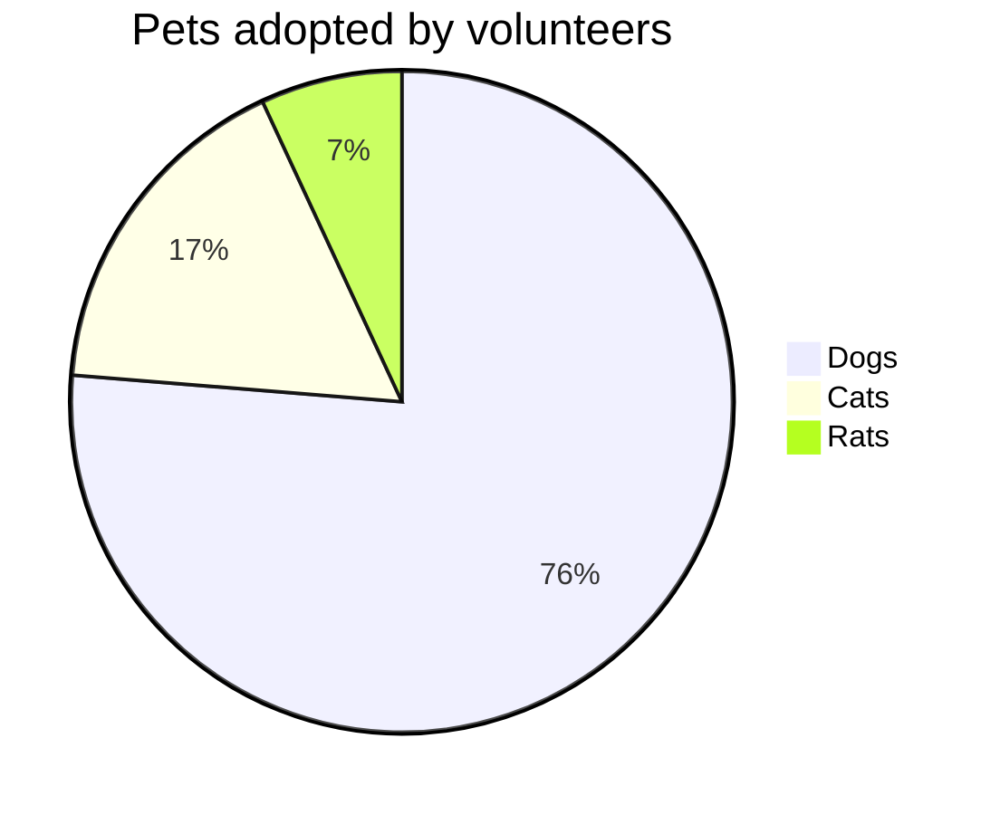

#### Technical

------

#### Experience

**NTTData** : *Senior Consultant* : __2012 to present__
	Designed Backbone.js based application to replace and improve upon existing legacy system.
	Introduced BDD style testing using Jasmine/Karma into existing application code.
	Developed modern solutions and features for large Enterprise Java systems.
	Collaborated with and guided global team members transitioning to client side architecture.
	**Technical Environment** Backbone.js, Jasmine.js, Coffeescript, SpringSource, Tomcat.

**Sumtotal Systems** : *Senior Java Developer* : __2008 to 2012__
	Designed and implemented features and improvements for multiple enterprise sized applications.
	Automated manual report generation for legacy ticketing system to provide reliable team analytics.
	Provided quality solutions to mission critical production issues in a timely manner.
	Proposed, designed and implemented a realtime tracking, deployment and notification system for test environments.
	**Technical Environment** Weblogic/Websphere, SpringSource/Wicket, MSSQL/Oracle, JUnit.

**We Can Pretend** : *Technical Consultant* : __2011__
	Architected and implemented a interactive media streaming service that enabled realtime, massively multiplayer, jeopardy-style interactions.
	Built host interface to inject synchronized prompts, overlays and widgets into live video stream.
	Created detailed documentation regarding technical requirements, project time lines and staffing guidelines for realizing total product offering.
	**Technical Environment** Wowza Media Server, Adobe Flex, Javascript.

**CIBC** : *Test Analyst* : __2007 to 2008__
	Eliminated manual testing processes with automated QTP scripts to increase productivity and limit repetitive human task based testing.
	Worked cohesively with other developers and team members to plan, design and implement multi-system automated tests which simulate multiple users and roles.
	**Technical Environment** VB, Quick Test Professional.

------

#### Projects

* **Ethical Barcode**
	<a href=http://www.ethicalbarcode.com class=not-printed>ethicalbarcode.com</a>
	Cordova based app(iOS & Android) that leverages a huge amalgamation of public data. Driven by over 30 web spiders, 15 webservices and multiple external databases it provides brand ratings from non-profit organisations by scanning product barcodes.

* **Halifax Crime Heatmap**
	<a href=http://www.crimeheatmap.ca class=not-printed>crimeheatmap.ca</a>
	HTML5 Animated heatmap visualising crimes in the city of Halifax. Built on a customised version Heatmap.js library which enables smooth animation. Won silver in the [Apps4Halifax](http://apps4halifax.ca/) city category.

* **Foxish**
	<a href=https://chrome.google.com/webstore/detail/jpgagcapnkccceppgljfpoadahaopjdb class=not-printed>chrome.google.com</a>
	Chrome extension that enables Firefox-style live RSS feeds with over fifteen thousand active users a 4/5 star rating. Featured on [Gizmodo](http://gizmodo.com/5609633/10-add+ons-you-have-to-know-about-for-google-chrome) & [LifeHacker](http://lifehacker.com/5603602/foxish-live-rss-adds-live-bookmarks-to-google-chrome).

------

### Education

**Bachelor of Science (Software Development)** __2003 to 2007__
	Seneca College of Applied Arts and Technology (Seneca@York), Toronto, Ontario

------



 
    <a href="/tags/#{{ tag | first | slugify }}/"
        style="font-size: {{ tag | last | size  |  times: 4 | plus: 80  }}%">
            {{ tag[0] | replace:'-', ' ' }} ({{ tag | last | size }})
    </a>


